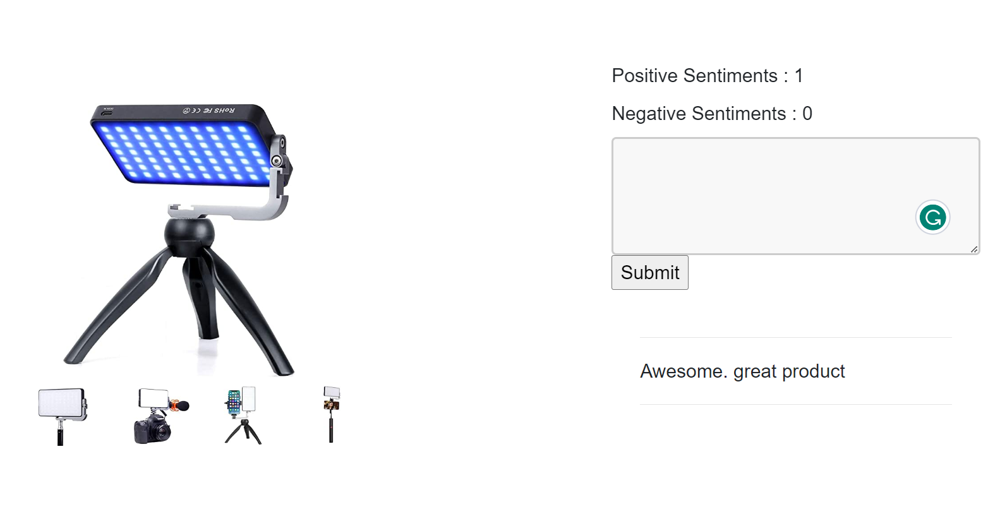

# 🎭 Sentiment Analysis Project

[](https://www.python.org/)
[](https://flask.palletsprojects.com/)
[](https://scikit-learn.org/)
[](LICENSE)

A machine learning-powered web application that analyzes text sentiment in real-time. This project uses natural language processing techniques to classify text as positive or negative sentiment, featuring a clean web interface built with Flask.

## 🚀 Features

- **Real-time Sentiment Analysis**: Instantly analyze text sentiment through a web interface
- **Machine Learning Pipeline**: Custom preprocessing with NLTK and scikit-learn
- **Interactive Web UI**: Clean, responsive Bootstrap-based interface
- **Sentiment Tracking**: Live counters for positive and negative sentiment counts
- **History Display**: View previously analyzed texts in chronological order
- **Logging System**: Comprehensive logging for debugging and monitoring
- **Model Persistence**: Pre-trained model with pickle serialization

## 🖼️ Demo



The application provides a split-screen interface where users can input text for analysis and view results alongside sentiment statistics.

## 🛠️ Installation

### Prerequisites
- Python 3.8 or higher
- pip package manager

### Setup Instructions

1. **Clone the repository:**
   ```bash
   git clone https://github.com/ashen0217/Sentiment_Analysis_Project.git
   cd Sentiment_Analysis_Project
   ```

2. **Create and activate a virtual environment:**
   ```bash
   # Create virtual environment
   python -m venv env
   
   # Activate virtual environment
   # On Windows:
   env\Scripts\activate
   # On macOS/Linux:
   source env/bin/activate
   ```

3. **Install required packages:**
   ```bash
   pip install -r requirements.txt
   ```

4. **Run the application:**
   ```bash
   python app.py
   ```

5. **Access the application:**
   Open your browser and navigate to `http://127.0.0.1:5000/`

## 📖 Usage

### Web Interface
1. Navigate to the home page
2. Enter text in the textarea
3. Click submit to analyze sentiment
4. View the result and updated sentiment counters
5. Review your analysis history below the input form

### API Endpoints

#### Home Page
- **URL**: `/`
- **Method**: `GET`
- **Description**: Displays the main interface with sentiment statistics and history

#### Sentiment Analysis
- **URL**: `/`
- **Method**: `POST`
- **Parameters**: 
  - `text` (string): The text to analyze
- **Response**: Redirects to home page with updated results

## 📁 Project Structure

```
Sentiment_Analysis_Project/
├── app.py                 # Flask web application
├── helper.py              # ML pipeline functions
├── logger.py              # Logging configuration
├── requirements.txt       # Project dependencies
├── demo.png              # Application screenshot
├── notebooks/            # Jupyter notebooks
│   ├── 01.download_dataset.ipynb
│   ├── 02.model_building.ipynb
│   └── 03.prediction_pipeline.ipynb
├── static/               # Static assets
│   ├── css/              # Stylesheets
│   ├── model/            # Pre-trained model files
│   │   ├── model.pickle
│   │   ├── vocabulary.txt
│   │   └── corpora/stopwords/english
│   └── products/         # Product images
├── templates/            # HTML templates
│   └── index.html
├── artifacts/            # Dataset and configuration
│   ├── kaggle.json
│   ├── sentiment-analysis-dataset.zip
│   └── sentiment_analysis.csv
└── README.md             # Project documentation
```

## 🔬 Machine Learning Pipeline

### 1. Data Preprocessing
- **Text cleaning**: URL removal, punctuation removal, lowercasing
- **Tokenization**: Converting text to individual words
- **Stopword removal**: Filtering common English stopwords
- **Stemming**: Reducing words to their root forms using Porter Stemmer

### 2. Feature Engineering
- **Bag of Words**: Custom vectorization using vocabulary mapping
- **Binary encoding**: Word presence/absence representation

### 3. Model Training
- **Algorithm**: Machine learning classifier (details in notebooks)
- **Training data**: Sentiment analysis dataset from Kaggle
- **Evaluation**: Model performance metrics documented in notebooks

### 4. Prediction Pipeline
- Real-time text preprocessing
- Feature vectorization
- Model prediction (0: positive, 1: negative)

## 📦 Key Dependencies

| Package | Version | Purpose |
|---------|---------|---------|
| Flask | Latest | Web framework |
| scikit-learn | 1.6.1+ | Machine learning library |
| NLTK | 3.9.1+ | Natural language processing |
| pandas | 2.3.1+ | Data manipulation |
| numpy | 2.3.2+ | Numerical computing |
| imbalanced-learn | 0.13.0+ | Handling imbalanced datasets |

For a complete list of dependencies, see [requirements.txt](requirements.txt).

## 🤝 Contributing

Contributions are welcome! Please feel free to submit a Pull Request. For major changes, please open an issue first to discuss what you would like to change.

### Development Setup
1. Fork the repository
2. Create a feature branch (`git checkout -b feature/AmazingFeature`)
3. Commit your changes (`git commit -m 'Add some AmazingFeature'`)
4. Push to the branch (`git push origin feature/AmazingFeature`)
5. Open a Pull Request

## 📊 Model Performance

The model training and evaluation process is documented in the Jupyter notebooks:
- Data exploration and preprocessing
- Model selection and hyperparameter tuning
- Performance metrics and validation

## 🐛 Troubleshooting

### Common Issues

1. **ImportError: No module named 'nltk'**
   - Ensure all dependencies are installed: `pip install -r requirements.txt`

2. **File not found errors for model files**
   - Verify that `static/model/` directory contains all required files
   - Check that the model pickle file exists

3. **Port already in use**
   - Kill existing Flask processes or use a different port:
     ```bash
     python app.py --port 5001
     ```

## 📄 License

This project is licensed under the MIT License - see the [LICENSE](LICENSE) file for details.

## 📬 Contact

For questions, suggestions, or feedback:
- **GitHub**: [@ashen0217](https://github.com/ashen0217)
- **Email**: ashen0217@gmail.com

## 🙏 Acknowledgments

- Dataset sourced from Kaggle sentiment analysis competitions
- NLTK for natural language processing tools
- Flask and Bootstrap for web framework and styling
- The open-source community for various libraries and tools used